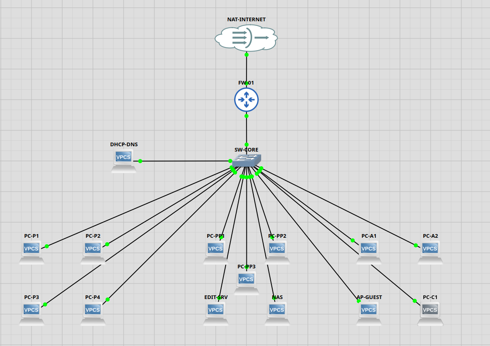

# Openframe Studios Capstone Project

## Overview
This repository contains the network infrastructure design and simulation for the Openframe Studios Capstone project, created as part of the WGU Bachelor of Science in Network Operations and Security program.

## Project Description
This project demonstrates the design, implementation, and documentation of a comprehensive **hybrid cloud network infrastructure** combining on-premises network simulation (via GNS3) with AWS cloud services. The project showcases practical networking skills including network topology design, VLAN configuration, firewall security, AWS VPC deployment, Site-to-Site VPN integration, and comprehensive security controls across both environments.

## Technologies Used
- **GNS3** - Network simulation and emulation platform
- **Dynamips** - Cisco router emulation
- **AWS (Amazon Web Services)** - Cloud infrastructure (VPC, EC2, VPN)
- **Cisco IOS** - Network device operating system
- **VLANs** - Virtual LAN segmentation
- **Site-to-Site VPN** - Secure hybrid cloud connectivity
- **Network Protocols** - TCP/IP, routing protocols, DHCP

## Project Structure
```
Openframe-Studios-Capstone/
├── New_Openframe_Studios_Capstone.gns3 # Main GNS3 project file
├── configs/                            # Device configurations
├── docs/                               # Project documentation and reports
├── images/                             # Network diagrams and screenshots
└── project-files/                      # GNS3 project artifacts (generated)
```

## Prerequisites
To open and run this network simulation, you'll need:

1. **GNS3** (version 2.2.56 or higher)
   - Download from: https://www.gns3.com/software/download

2. **Operating System Support**
   - Windows 10/11
   - macOS
   - Linux (Ubuntu, Debian, Fedora)

3. **Hardware Requirements**
   - Minimum 4GB RAM (8GB recommended)
   - Multi-core processor
   - 10GB free disk space

## Installation & Setup

### Step 1: Install GNS3
1. Download GNS3 from the official website
2. Run the installer and follow the setup wizard
3. Configure GNS3 VM or local compute settings

### Step 2: Clone the Repository
```bash
git clone https://github.com/Get-PrivilegedLogic/Openframe-Studios-Capstone.git
cd Openframe-Studios-Capstone
```

### Step 3: Open the Project
1. Launch GNS3
2. Click **File → Open Project**
3. Navigate to the cloned repository
4. Select `New_Openframe_Studios_Capstone.gns3`

### Step 4: Configure Network Devices
*Add your device configuration steps here based on your specific topology*

## Usage

### Starting the Network
1. Open the project in GNS3
2. Click the **Start All Devices** button (green play icon)
3. Wait for all devices to boot

### Accessing Devices
- Right-click on any device and select **Console** to access the CLI
- Use configured credentials to log in

### Testing Connectivity
```bash
# Example: Test connectivity between devices
ping [destination-ip]
traceroute [destination-ip]
```

## Network Topology

This project implements a hybrid cloud network infrastructure integrating on-premises GNS3 simulated environment with AWS cloud services.



### Key Components
- **On-Premises Network:**
  - Core switches with VLAN segmentation
  - Firewall for security and routing
  - Multiple VLANs for network segmentation
  - DHCP and static IP configurations
  - Network attached storage (NAS)

- **AWS Cloud Infrastructure:**
  - VPC with public and private subnets
  - EC2 instances for application hosting
  - Site-to-Site VPN connection
  - Security groups for access control
  - Route tables for traffic management

## Features Implemented
- [x] **Network Topology Design** - Hybrid cloud architecture with GNS3 and AWS
- [x] **VLAN Configuration** - Multiple VLANs for network segmentation (TC1)
- [x] **IP Addressing** - DHCP and static IP configurations (TC2)
- [x] **Inter-VLAN Routing** - Firewall-based routing with access control (TC3)
- [x] **AWS VPC Setup** - Public and private subnets with route tables (TC4)
- [x] **EC2 Configuration** - Static and elastic IP assignments (TC5)
- [x] **VPN Integration** - Site-to-Site VPN between on-prem and AWS (TC6, TC7)
- [x] **Security Implementation** - Security groups and VLAN-based access control (TC8)
- [x] **Comprehensive Documentation** - Full functionality report with test cases

## Learning Outcomes
This project demonstrates proficiency in:
- Hybrid cloud network architecture design
- VLAN configuration and inter-VLAN routing
- Cisco IOS configuration and management
- AWS VPC design and implementation
- Site-to-Site VPN configuration and troubleshooting
- Security group and firewall rule management
- IP addressing (DHCP and static assignments)
- Network segmentation and access control
- Cloud-to-on-premises integration
- Comprehensive technical documentation

## Troubleshooting

### Common Issues

**Issue: GNS3 can't find devices**
- Solution: Ensure you have the required IOS images or appliances installed

**Issue: Devices won't start**
- Solution: Check that GNS3 VM is running (if using VM integration)
- Solution: Verify you have sufficient RAM allocated

**Issue: Console won't open**
- Solution: Check that your terminal emulator is configured correctly

## Project Documentation

### 📄 Reports
- [BSCNE Functionality Report](docs/BSCNE_Functionality_Report_Final.docx) - Complete project documentation with test cases

### 📸 Screenshots & Diagrams
- [Network Topology](images/Section-B-GNS3-Topology.png)
- **Test Case 1:** VLAN Configuration
  - [VLAN Config Part 1](images/TC1-SW-CORE-VLAN-Config-1.png)
  - [VLAN Config Part 2](images/TC1-SW-CORE-VLAN-Config-2.png)
  - [VLAN Config Part 3](images/TC1-SW-CORE-VLAN-Config-3.png)
  - [VLAN Interfaces](images/TC1-VLAN-Interfaces.png)
- **Test Case 2:** IP Configuration
  - [DHCP Configuration](images/TC2-DHCP-PC-P1.png)
  - [Static IP - Server](images/TC2-Static-EDIT-SRV.png)
  - [Static IP - NAS](images/TC2-Static-NAS.png)
- **Test Case 3:** Inter-VLAN Routing
  - [Allowed: VLAN 10 → VLAN 20](images/TC3-Allowed-VLAN10-to-VLAN20.png)
  - [Denied: VLAN 10 → VLAN 30](images/TC3-Denied-VLAN10-to-VLAN30.png)
- **Test Case 4:** AWS VPC Configuration
  - [VPC Subnets](images/TC4-VPC-Subnets.png)
  - [Public Route Table](images/TC4-Public-Route-Table.png)
  - [Private Route Table](images/TC4-Private-Route-Table.png)
- **Test Case 5:** EC2 IP Assignment
  - [Static Private IP](images/TC5-EC2-Static-IP.png)
  - [Elastic IP - Backup](images/TC5-EC2-Backup-Private-IP.png)
- **Test Case 6:** Inter-Subnet Connectivity
  - [Inter-Subnet Communication](images/TC6-Inter-Subnet-Connectivity.png)
- **Test Case 7:** VPN Site-to-Site
  - [VPN Tunnel Status](images/TC7-VPN-Tunnel-Status.png)
  - [AWS to On-Prem Ping](images/TC7-AWS-to-OnPrem-Ping.png)
  - [On-Prem to AWS Ping](images/TC7-OnPrem-to-AWS-Ping.png)
- **Test Case 8:** Security Controls
  - [Public Security Group Rules](images/TC8-Public-SG-Inbound-Rules.png)
  - [Private Security Group Rules](images/TC8-Private-SG-Inbound-Rules.png)
  - [NAS Access - Allowed VLAN 20](images/TC8-NAS-Allowed-VLAN20.png)
  - [NAS Access - Denied VLAN 10](images/TC8-NAS-Denied-VLAN10.png)
  - [NAS Access - Denied VLAN 30](images/TC8-NAS-Denied-VLAN30.png)
  - [NAS Access - Denied VLAN 40](images/TC8-NAS-Denied-VLAN40.png)
  - [VLAN 40 Internet Access](images/TC8-VLAN40-Allowed-Internet.png)
  - [VLAN 40 Isolation](images/TC8-VLAN40-Denied-VLAN10.png)

### 🔧 Configuration Files
- [Firewall Configuration](configs/FW-01.txt)
- [Updated Firewall Config](configs/New_FW-01.txt)

## Future Enhancements
- [ ] Implement additional security features
- [ ] Add monitoring and logging solutions
- [ ] Expand network topology
- [ ] Implement automation scripts

## License
This project is licensed under the MIT License - see the [LICENSE](LICENSE) file for details.

## Author
**Get-PrivilegedLogic**
- GitHub: [@Get-PrivilegedLogic](https://github.com/Get-PrivilegedLogic)

## Acknowledgments
- Western Governors University
- GNS3 Community
- Openframe Studios

## Contact
For questions or feedback about this project, please open an issue or reach out through GitHub.

---

*This project was created as part of the WGU Capstone program.*
